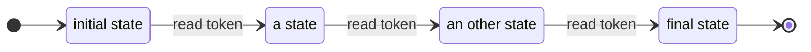
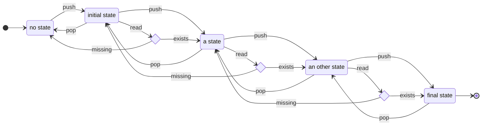

# Automatons

- [Basic features of an automaton](#basic-features-of-an-automaton)
- [Automatons integrated in this project](#automatons-integrated-in-this-project)
    - [StateAutomaton](#state-automaton)
    - [StackAutomaton](#stack-automaton)

## Basic features of an automaton
Every automaton created from this project have only one method `Read(IAutomatonToken token)` that is the base method for interacting with the automaton. This is described in the interface `IAutomaton`.

Depending on the type of automaton used, this method can have different behaviours: classic automaton, automaton with an integrated stack for moving the automaton back... It is possible to create your own interpretation of this method by implementing the `IAutomaton` interface and the method `Read(IAutomatonToken token)`.

## Automatons integrated in this project

The project contains two types of implemented automatons
- [StateAutomaton](#state-automaton)
- [StackAutomaton](#stack-automaton)

### State Automaton
---

The `StateAutomaton` is a common automaton type with always one active state. From each state, the automaton reads a token to transfer to an other state. You may also have a look on [a use case of this automaton](UseCases#text-parsing).

**State diagram**

> If a state has no default transition and the token read is not one of the existing transitions, a `NoDefaultStateException` is raised.

**Fields**

|Name|Type|Description|
|----|----|-----------|
|InitialState|IState|The initial state, set in the constructor of the automaton|
|CurrentState|IState|The current state of the automaton|

**Constructors**

|Name|Parameters|Description|
|----|----------|-----------|
|StateAutomaton(IState initialState)|initial state of the automaton|Default constructor of a new instance of StateAutomaton|

**Methods**

|Name|Parameters|Return Type|Description|
|----|----------|-----------|-----------|
|Read(IAutomatonToken token)|token to read|void|Process the given token and updates the current state accordingly.|

### Stack Automaton
---

The `StackAutomaton` is an automaton combined with a stack of states. When reading a state, the new state is pushed on the stack. The particularity of such an automaton is on default state (when no transition corresponds to the token read): instead of throwing an error, it returns to the previous state in the stack. Have a look on [a use case of this automaton](UseCases#runtime-configuration-edition).

Methods like `Push` and `Pop` allow to directly add or remove to and from the stack.

**Fields**

|Name|Type|Description|
|----|----|-----------|
|CurrentState|IState|The current state of the automaton.|

**Constructors and build methods**

|Name|Parameters|Description|
|----|----------|-----------|
|StackAutomaton()||Default constructor of a new instance of StackAutomaton|
|SetAutoPerformAction()||Call it once to automatically perform actions linked to states when the automatons pops one from the stack|

**Methods**

|Name|Parameters|Return Type|Description|
|----|----------|-----------|-----------|
|Read(IAutomatonToken token)|token to read|void|Process the given token, goes to the new state and push it on the stack|
|Push(IState newState [, bool performAction])|State to push and whether or not to perform the action linked to it|void|Push a new state on the stack|
|Pop([bool performAction])|Whether or not to perform the action linked to the state|void|Pop the last state from the stack|
|IsEmpty()||bool|Boolean value defining if there are still states in the stack|

**Events**

|Name|Parameters|Description|
|----|----------|-----------|
|StatePushed||This event is triggered after a state is pushed onto the stack|
|StatePopped||This event is triggered after a state is popped from the stack|

