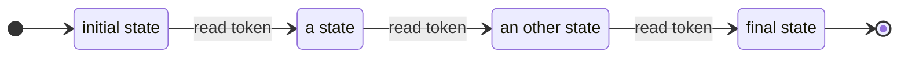
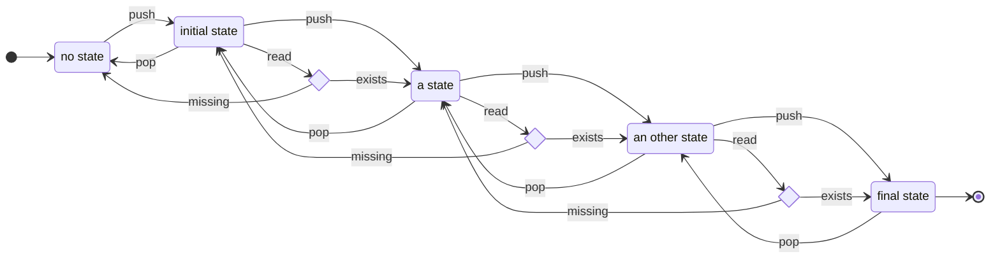

# Automatons

- [Basic features of an automaton](#basic-features-of-an-automaton)
- [Automatons integrated in this project](#automatons-integrated-in-this-project)
    - [StateAutomaton](#state-automaton)
    - [StackAutomaton](#stack-automaton)

## Basic features of an automaton
Every automaton created from this project have only one method `Read(IAutomatonToken token)` that is the base method for interacting with the automaton. This is described in the interface `IAutomaton`.

Depending on the type of automaton used, this method can have different behaviours: classic automaton, automaton with an integrated stack for moving the automaton back... It is possible to create your own interpretation of this method by implementing the `IAutomaton` interface and the method `Read(IAutomatonToken token)`.

## Automatons integrated in this project

The project contains two types of implemented automatons
- [StateAutomaton](#state-automaton)
- [StackAutomaton](#stack-automaton)

### State Automaton
---

The `StateAutomaton` is a common automaton type with always one active state. From each state, the automaton reads a token to transfer to an other state. You may also have a look on [a use case of this automaton](UseCases#text-parsing).

**State diagram**


```mermaid
stateDiagram-v2
direction LR

s0: initial state
s1: a state
s2: an other state
sf: final state

[*] --> s0
s0 --> s1: read token
s1 --> s2: read token
s2 --> sf: read token
sf --> [*]
```

> If a state has no default transition and the token read is not one of the existing transitions, a `NoDefaultStateException` is raised.

**Fields**

|Name|Type|Description|
|----|----|-----------|
|CurrentState|IState|The current state of the automaton|
|IsValid|bool|Indicate whether the automaton is in a valid state (i.e., has reached a final state)|

**Constructors**

|Name|Parameters|Description|
|----|----------|-----------|
|StateAutomaton(IState initialState)|initial state of the automaton|Default constructor of a new instance of StateAutomaton|

**Methods**

|Name|Parameters|Return Type|Description|
|----|----------|-----------|-----------|
|Read(IAutomatonToken token)|token to read|void|Process the given token and updates the current state accordingly.|

**Events**

|Name|Arguments|Description|
|----|----------|-----------|
|FinalStateReached|the final state reached|This event is triggered when the automaton reaches a final state|

### Stack Automaton
---

The `StackAutomaton` is an automaton combined with a stack of states. 

When reading a state, the new state is pushed on the stack. 
The particularity of such an automaton is on default state (when no transition corresponds to the token read): instead of throwing an error, it returns to the previous state in the stack. Have a look on [a use case of this automaton](UseCases.md#runtime-configuration-edition).

Methods like `Push` and `Pop` allow to directly add or remove to and from the stack.


```mermaid
stateDiagram-v2
direction LR

null: no state
s0: initial state
s1: a state
s2: an other state
s3: final state

state s0if <<choice>>
state s1if <<choice>>
state s2if <<choice>>

[*] --> null
null --> s0: push

s0 --> s1: push
s0 --> null: pop
s0 --> s0if: read
s0if --> null: missing
s0if --> s1: exists

s1 --> s2: push
s1 --> s0: pop
s1 --> s1if: read
s1if --> s0: missing
s1if --> s2: exists

s2 --> s3: push
s2 --> s1: pop
s2 --> s2if: read
s2if --> s1: missing
s2if --> s3: exists

s3 --> s2: pop

s3 --> [*]


```

**Fields**

|Name|Type|Description|
|----|----|-----------|
|CurrentState|IState|The current state of the automaton.|
|IsEmpty|bool|Indicate whether the automaton is empty (i.e., has no state in the stack).|
|IsValid|bool|Indicate whether the automaton is in a valid state (same as IsEmpty).|

**Constructors and build methods**

|Name|Parameters|Description|
|----|----------|-----------|
|StackAutomaton()||Default constructor of a new instance of StackAutomaton|

**Methods**

|Name|Parameters|Return Type|Description|
|----|----------|-----------|-----------|
|Read(IAutomatonToken token)|token to read|void|Process the given token, activates new state and push it on the stack. If no transition is found, it pops the stack and activates the previous state.|
|Push(IState newState)|State to push|void|Push a new state on the stack. If it is a final node, automatically pops it after pushing it.|
|Pop()||void|Pop the last state from the stack.|

**Events**

|Name|Arguments|Description|
|----|----------|-----------|
|FinalStateReached|the final state reached|This event is triggered when the automaton reaches a final state|
|StatePushed||This event is triggered after a state is pushed onto the stack|
|StatePopped||This event is triggered after a state is popped from the stack|

**Pushing and popping states**

Although the method `Read` automatically handles the stack, you may still want in some scenarios to manually push or pop states from the stack. 
The `Push` and `Pop` methods allow you to do this. However, these two methods don't activate or deactivate states, so there is a pattern to follow.

If you want to push a state on the stack while triggering its action, you should do so:
```csharp
Automaton.CurrentState.Deactivate();
Automaton.Push(newState);
Automaton.CurrentState.Activate();
```

However, if you just wish to store this state on the stack without triggering its action, you can just use the `Push` method.
This can be useful when you want to store intermediate states on the stach without triggering their actions, and then return to them later by popping them.

The same applies for popping a state from the stack. If you want to pop a state and trigger the action, you should do so:
```csharp
Automaton.CurrentState.Deactivate();
Automaton.Pop();
Automaton.CurrentState.Activate();
```

But if you just want to pop a state from the stack without triggering its action, you can just use the `Pop` method. 
This is particularely useful when you want to return several states back in the stack without triggering the intermediate state actions.

> Note that the `Read` method does that automatically and you don't have to worry about it in the majority of scenarios. 
> The only time you should worry about it is when you are manually pushing or popping states from the stack for more specific use cases.